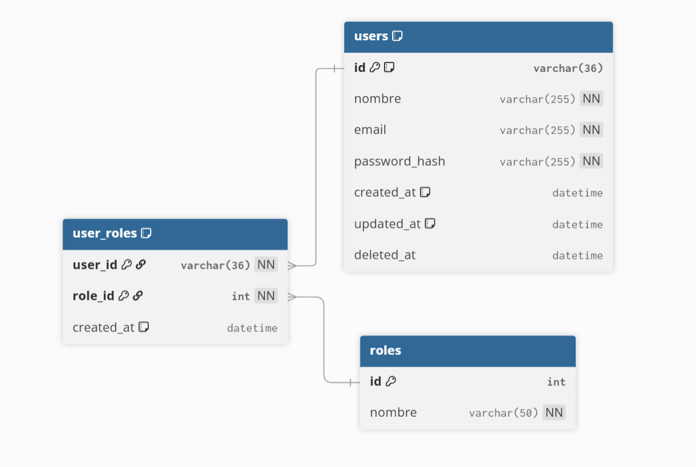

# API de Gestión de Usuarios

> 📖 **Es mucho más sencillo ver y leer el README desde el repositorio:** [https://github.com/MdeMyke/PruebaTecnicaBack](https://github.com/MdeMyke/PruebaTecnicaBack)

## 🐳 Ejecutar con Docker (Recomendado)

```bash
# Construir y ejecutar
docker compose up --build

# Solo ejecutar
docker compose up -d

# Detener
docker compose down
```

**⏱️ Nota importante:** La primera ejecución puede demorar varios minutos debido a la descarga de la imagen de MySQL. Esto es normal y solo ocurre la primera vez.

## 🛠️ Ejecutar localmente

### Prerrequisitos

1. **Tener Node.js** (versión 16 o superior)
2. **Tener MySQL Server** en tu sistema
3. **Instalar Sequelize CLI** globalmente:
   ```bash
   npm install -g sequelize-cli
   ```

### Dependencias incluidas

El proyecto ya incluye las siguientes dependencias que se instalarán automáticamente:
- **dotenv**: Para cargar variables de entorno desde archivo `.env`
- **sequelize**: ORM para base de datos
- **mysql2**: Driver de MySQL para Node.js
- **express**: Framework web

### Instalación paso a paso

#### 1. Instalar dependencias del proyecto
```bash
npm install
```

#### 2. Crear base de datos MySQL
```sql
CREATE DATABASE prueba_tecnica;
```

#### 3. Configurar variables de entorno
Crear archivo `.env` en la raíz del proyecto:

```env
# Configuración de Base de Datos
DB_HOST=localhost
DB_PORT=3306
DB_NAME=prueba_tecnica
DB_USER=root
DB_PASSWORD=tu_password_aqui

# Configuración del Servidor
PORT=3000
NODE_ENV=development
```

**⚠️ Importante:** Reemplaza `tu_password_aqui` con la contraseña de tu MySQL.

#### 4. Ejecutar migraciones
```bash
npm run db:migrate
```

#### 5. Ejecutar seeders (datos de ejemplo)
```bash
npm run db:seed
```

#### 6. Iniciar el servidor
```bash
npm start
```

### Comandos útiles

```bash
# Configurar todo de una vez (migraciones + seeders)
npm run db:setup

# Solo migraciones
npm run db:migrate

# Solo seeders
npm run db:seed

# Revertir migraciones
npm run db:migrate:undo

# Revertir seeders
npm run db:seed:undo
```

## 📊 Endpoints

📖 **Documentación completa de la API:** [API_DOCUMENTATION.md](API_DOCUMENTATION.md)

La API incluye endpoints para gestión de usuarios y roles con operaciones CRUD completas.

## 📁 Estructura del Proyecto

```
PruebaTecnicaBack/
├── src/
│   ├── controllers/          # Controladores de la API
│   │   ├── user.controller.js
│   │   └── role.controller.js
│   ├── models/              # Modelos de Sequelize
│   │   ├── User.js
│   │   ├── Role.js
│   │   ├── UserRole.js
│   │   └── index.js
│   ├── routes/              # Definición de rutas
│   │   ├── index.js
│   │   ├── user.routes.js
│   │   └── role.routes.js
│   ├── database/            # Configuración de base de datos
│   │   ├── config.js
│   │   ├── connection.js
│   │   ├── migrations/      # Migraciones de Sequelize
│   │   └── seeders/         # Datos de ejemplo
│   └── assets/
│       └── img/
├── API_DOCUMENTATION.md     # Documentación completa de la API
├── docker-compose.yml       # Configuración de Docker
├── Dockerfile              # Imagen de Docker
├── index.js                # Punto de entrada de la aplicación
├── package.json            # Dependencias y scripts
└── README.md               # Este archivo
```

### Descripción de carpetas:
- **`controllers/`**: Lógica de negocio y manejo de requests/responses
- **`models/`**: Definición de modelos de datos con Sequelize
- **`routes/`**: Definición de endpoints y rutas de la API
- **`database/`**: Configuración, migraciones y seeders de la base de datos
- **`migrations/`**: Archivos para crear/modificar estructura de la BD
- **`seeders/`**: Datos iniciales y de ejemplo para la base de datos

## 🗄️ Estructura de la Base de Datos



### Tablas principales:
- **users**: Información de usuarios
- **roles**: Roles del sistema
- **user_roles**: Tabla pivote para relación muchos a muchos

## 🧪 Pruebas con Postman

📖 **Documentación completa de la API:** [API_DOCUMENTATION.md](API_DOCUMENTATION.md)

La documentación incluye ejemplos detallados de todas las operaciones, códigos de respuesta y casos de uso.


## 🔧 Solución de problemas

### Error de conexión a MySQL
- Verifica que MySQL esté corriendo
- Confirma las credenciales en `.env`
- Asegúrate que la base de datos existe

### Error de Sequelize CLI
- Instala globalmente: `npm install -g sequelize-cli`
- Verifica la versión: `sequelize --version`

### Puerto ocupado
- Cambia el puerto en `.env`: `PORT=3001`
- O mata el proceso que usa el puerto 3000

## 🚨 SQL de Emergencia

Si las migraciones llegan a fallar o los seeders no funcionan, aquí está la base de datos para insertar directamente en MySQL:

### 1. Crear tablas

```sql
-- Crear tabla users
CREATE TABLE users (
  id INT AUTO_INCREMENT PRIMARY KEY,
  nombre VARCHAR(255) NOT NULL,
  email VARCHAR(255) NOT NULL UNIQUE,
  password_hash VARCHAR(255) NOT NULL,
  created_at TIMESTAMP DEFAULT CURRENT_TIMESTAMP,
  updated_at TIMESTAMP DEFAULT CURRENT_TIMESTAMP ON UPDATE CURRENT_TIMESTAMP,
  deleted_at TIMESTAMP NULL DEFAULT NULL
);

-- Crear tabla roles
CREATE TABLE roles (
  id INT AUTO_INCREMENT PRIMARY KEY,
  nombre VARCHAR(50) NOT NULL UNIQUE
);

-- Crear tabla user_roles (tabla pivote)
CREATE TABLE user_roles (
  user_id INT NOT NULL,
  role_id INT NOT NULL,
  created_at TIMESTAMP DEFAULT CURRENT_TIMESTAMP,
  PRIMARY KEY (user_id, role_id),
  FOREIGN KEY (user_id) REFERENCES users(id) ON DELETE CASCADE,
  FOREIGN KEY (role_id) REFERENCES roles(id) ON DELETE CASCADE
);
```

### 2. Insertar datos de ejemplo

```sql
-- Insertar roles
INSERT INTO roles (nombre) VALUES 
('admin'),
('editor'),
('usuario');

-- Insertar usuarios
INSERT INTO users (nombre, email, password_hash, created_at, updated_at) VALUES 
('Administrador', 'admin@example.com', '$2a$10$abcdefghijklmnopqrstuvwxyz0123456789', NOW(), NOW()),
('Usuario Prueba', 'user@example.com', '$2a$10$0123456789abcdefghijklmnopqrstuvwxyz', NOW(), NOW());

-- Asignar roles a usuarios
INSERT INTO user_roles (user_id, role_id, created_at) VALUES 
(1, 1, NOW()), -- Admin tiene rol 'admin'
(1, 2, NOW()), -- Admin tiene rol 'editor'
(2, 3, NOW()); -- Usuario normal tiene rol 'usuario'
```

### 3. Verificar datos

```sql
-- Ver usuarios con sus roles
SELECT 
  u.id,
  u.nombre,
  u.email,
  GROUP_CONCAT(r.nombre) as roles
FROM users u
LEFT JOIN user_roles ur ON u.id = ur.user_id
LEFT JOIN roles r ON ur.role_id = r.id
GROUP BY u.id, u.nombre, u.email;
```

